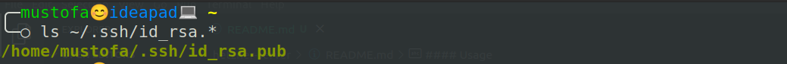

#### Usage

**1. Check your `.ssh` folder**


- If you don't have this files

- 

  - Create `ssh` file with the following command

    - `ssh-keygen`

**2. Create variable to read them from environment**

  - Export this variable in order to use securely

    - `export TF_VAR_hcloud_token="xxxxx"`

    - you can check the following command `echo $hcloud_token`


**3. Execute commands to create infrastructure**

```shell
terraform init
terraform plan
terraform apply -auto-approve && bash output.sh 
```


### Tasks
- need optimize manifest file
- need write user data file to install all necessary utilities (curl, git, ....)
- research more volume, ip, firewall etc